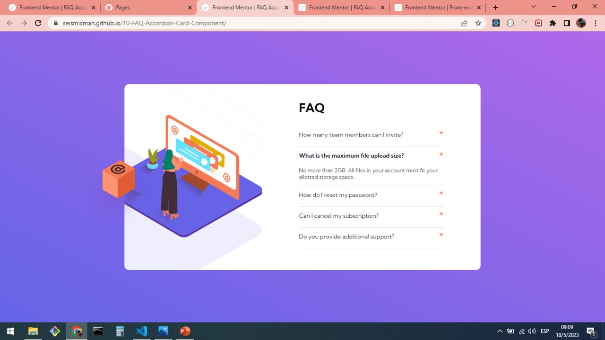
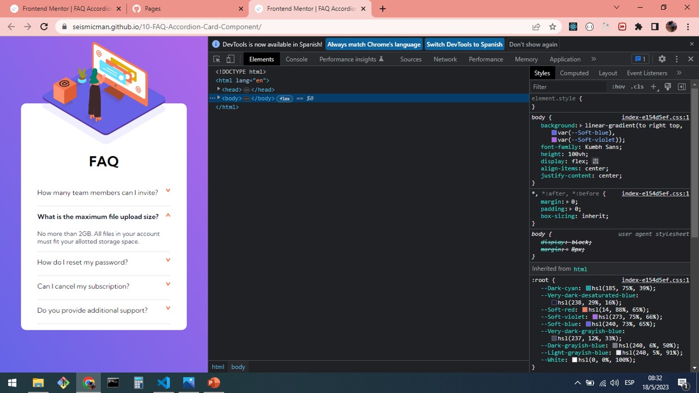

# Frontend Mentor - FAQ accordion card solution

This is a solution to the [FAQ accordion card challenge on Frontend Mentor](https://www.frontendmentor.io/challenges/faq-accordion-card-XlyjD0Oam). Frontend Mentor challenges help you improve your coding skills by building realistic projects.

## Table of contents

- [Overview](#overview)
  - [Screenshot](#screenshot)
  - [Links](#links)
- [My process](#my-process)
  - [Built with](#built-with)
  - [What I learned](#what-i-learned)
  - [Continued development](#continued-development)
  - [Useful resources](#useful-resources)
- [Author](#author)

## Overview

### Screenshot

### Links

Solution URL: [https://seismicman.github.io/09-Profile-Card-Component/](https://seismicman.github.io/09-Profile-Card-Component/)

## My process

### Built with

- Semantic HTML5 markup
- CSS custom properties
- Flexbox
- [React](https://reactjs.org/) - JS library

### What I learned

Although this is a project that we can mainly develop in HTML and CSS, I developed it in React as a single component and CSS for the styles. This is an important challenge to understand CSS positioning very well: some images were located with "absolute" and others with "relative". Other tool so useful to develop this challenge was the CSS short hand "background", including others as "background-image","background-position", "background-size", "background-repeat among others. Also, it was very useful to understand Flexbox to organize the different components of the User Interface and the use of media queries to switch between desktop and mobile versions.

### Continued development

I would like to continue developing this challenges using React as main resource and complementing with other ones as HTML5, CSS, SAAS, among others

### Useful resources

- [https://www.youtube.com/@FaztCode <- To learn about tech for developers](https://www.youtube.com/@FaztCode) - Fun youtube channel where you will find a wide variety of topics about technology for developers. It was very useful for me to deploy my projects on github and github pages.
- [https://jonmircha.com/cursos <- To learn about frontend resources](https://jonmircha.com/cursos) - This is an amazing spanish channel when do you can learn about HTML5, CSS, React, Git and Github, among others. I'd recommend it to anyone still learning about these resources.

## Author

- Frontend Mentor - [@seismicman](https://www.frontendmentor.io/profile/seismicman)
